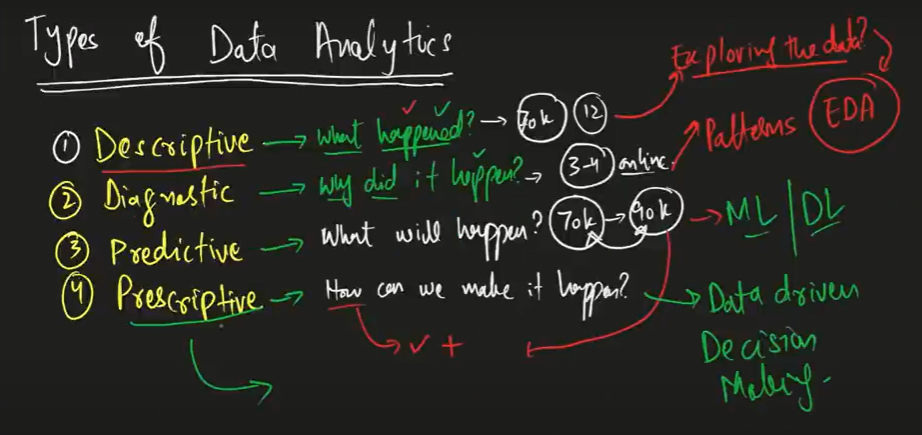

# 1- Headings
How to give headings in markdown files?
# Heading 1
## Heading 2
### Heading 3
#### Heading 4


# 2- Block of Words

This is a normal text in Markdown

> This is a block of special text 
> 
> This is another block of special text

# 3- Line Breaks

This is 40 days long data science with Python.\
and this is another line of text.

# 4- Combine Two Things

> # Heading1
>
> ## Heading 2

# 5-Face of Text

**Bold**

*Italic*

***Bold and Italic***

you can use also use other symbols instead of staric symbol.

__Bold__

_italic_

# 6-Bullet/Lists

- Item 1
- Item 2
- Item 3
-  item 4
    - item 4.1
       - item 4.1.1
    - item 4.2
- Day 6


> Using Numbers 

1. Item 1
2. Item 2
3. Item 3

# 7- Page Break

This is page-1
----
____
***
This is page 2

# 8- Link and Hyperlink


[Tabarak Youtube channel]:https://www.youtube.com/playlist?list=PL4xrsMh2WhkrB5zWEJheKzE126iNrnn8h

> To Access the C++ tutorial for begineer , click [here][Tabarak Youtube channel]

# 9 - Images and Figures with Link

This is the notes of previous lecture 

 


you can't see this picture bcz this is in a markdown
comment

[//]: 


[View PDF](https://drive.google.com/uc?id=13O_UIHa-xvto8SWp79ufFaFm2r6Io5QP)


# 10- Adding Code / Block Of Code

`print('tabarak')`

> This will show the color according to python language

```python
a=1
b=2
print(a+b)
```

# 11- Adding Tables

| Species | Petal_length | sepal_length|
|:---------:| :-------------:| :------------:|
| Virginica | 5.1 | 3.5| 
| Satosa | 6.2 | 8.5| 
| versicolor | 9.2 | 10.5| 


# 12- Contents

[1-Headings](#1--headings)\
[2-Block Of Words](#2--block-of-words)\
[3-Line Breaks](#3--line-breaks)\
[4-Combine Two Things](#4--combine-two-things)\
[5-Face Of Text](#5-face-of-text)\
[6-Bullet Lists](#6-bulletlists)\
[7-Page Break](#7--page-break)\
[8-Link and HyperLink](#8--link-and-hyperlink)\
[9-Images and Figures With Link](#9---images-and-figures-with-link)\
[10-Adding Code / Block Of Code](#10--adding-code--block-of-code)\
[11-Adding Tables](#11--adding-tables)\
[12-Table of Contents](#12--contents)

# Intsall Extensions

_**Bold**_